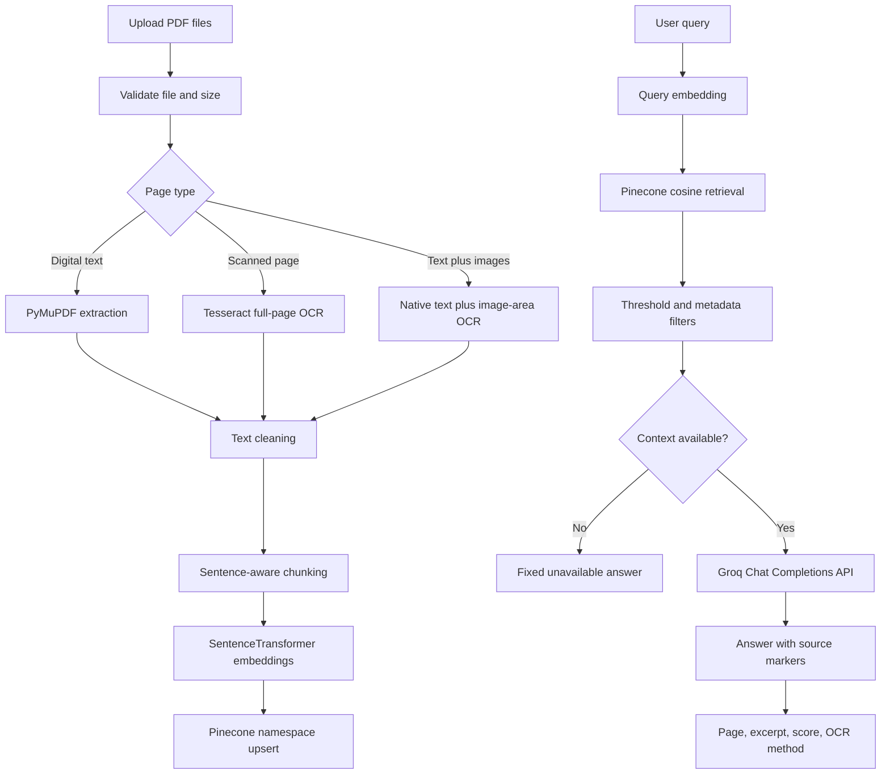

# Intermediate RAG System Using Pinecone and Groq

This project accepts digital, scanned, and mixed-content PDF documents.

## Pipeline



## Included enhancements

- Multi-document support
- Session query history
- Adjustable chunk size and overlap
- Adjustable top-k retrieval
- Adjustable similarity threshold
- Document and page metadata filters
- Similarity-derived confidence display
- Query logging
- OCR mode selection

## Component roles

- OCR extracts text from scanned pages and images.
- SentenceTransformer converts extracted text into embeddings.
- Pinecone stores and retrieves embeddings.
- Groq generates the final grounded answer.

## Installation

### 1. Create a virtual environment

Windows:

```powershell
python -m venv .venv
.venv\Scripts\activate
```

macOS/Linux:

```bash
python3 -m venv .venv
source .venv/bin/activate
```

### 2. Install Python packages

```bash
pip install -r requirements.txt
```

### 3. Install Tesseract OCR

Ubuntu/Debian:

```bash
sudo apt update
sudo apt install tesseract-ocr tesseract-ocr-eng
```

On Windows, install Tesseract and normally add this to `.env`:

```env
TESSDATA_PREFIX=C:/Program Files/Tesseract-OCR/tessdata
```

For Urdu OCR, install Urdu language data and use:

```env
OCR_LANGUAGE=eng+urd
```

### 4. Configure environment variables

Copy `.env.example` to `.env`, then add:

```env
PINECONE_API_KEY=your_real_key
GROQ_API_KEY=your_real_key
```

Do not upload `.env` to GitHub.

### 5. Run

```bash
streamlit run app.py
```

## Groq implementation

OpenAI is completely removed. The project uses the official Groq SDK:

```python
from groq import Groq

client = Groq(api_key=...)
response = client.chat.completions.create(
    model="llama-3.3-70b-versatile",
    messages=[
        {"role": "system", "content": system_prompt},
        {"role": "user", "content": user_prompt},
    ],
    temperature=0.0,
    max_tokens=700,
)
answer = response.choices[0].message.content
```

The model is controlled by `GROQ_MODEL` in `.env`.

## Pinecone behavior

The application automatically creates a cosine index when necessary,
uses namespaces, batches vector upserts, stores traceable metadata, and
supports document/page metadata filtering.

If the embedding model changes its vector dimension, use a new Pinecone
index name or recreate the old index.

## Hallucination prevention

The Groq prompt receives only retrieved chunks. It must cite source
markers such as `[Source 1]`. When no chunk passes the similarity
threshold, the application returns exactly:

> The answer is not available in the provided document.
